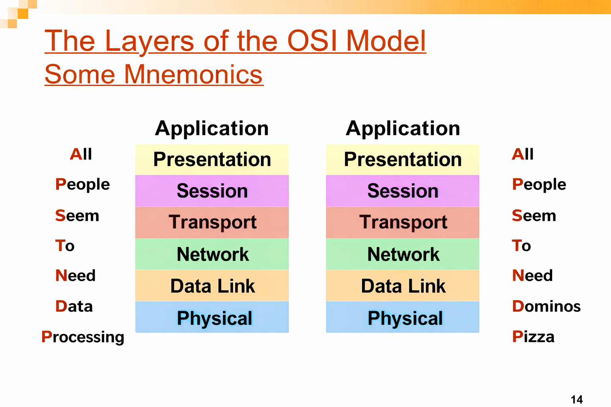
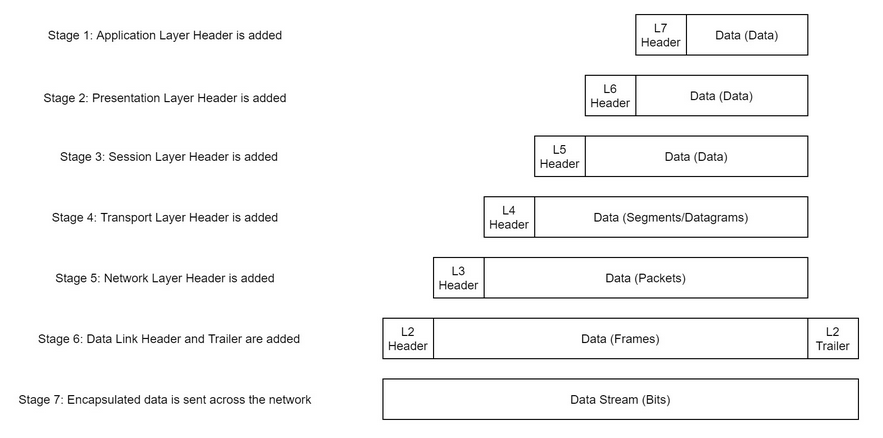
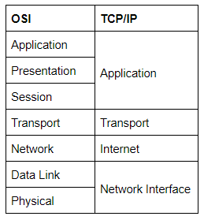
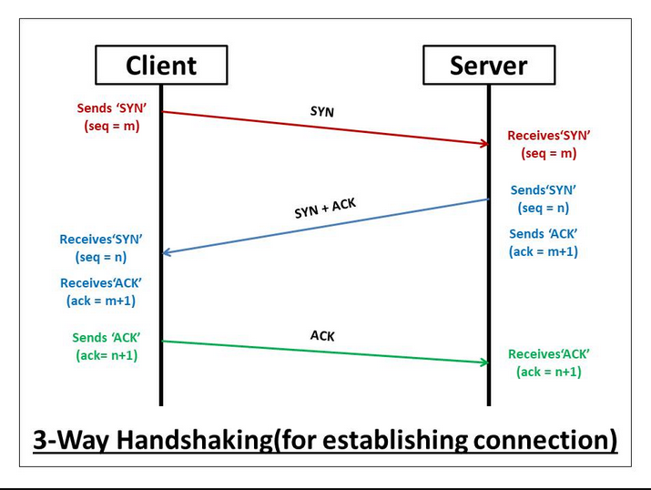
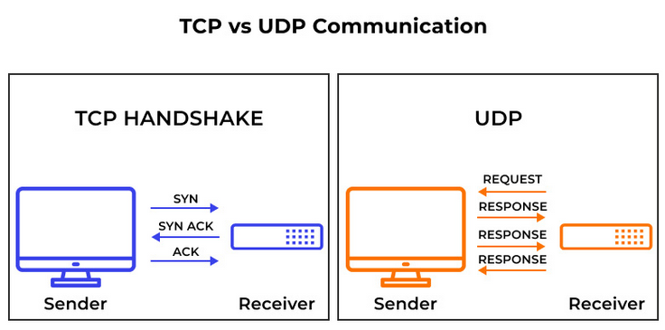
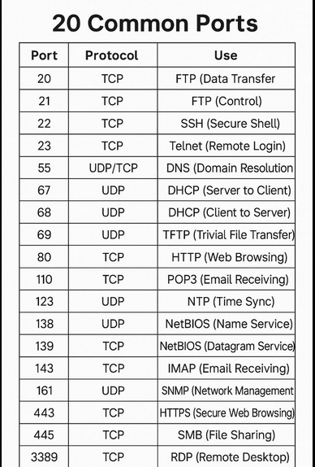
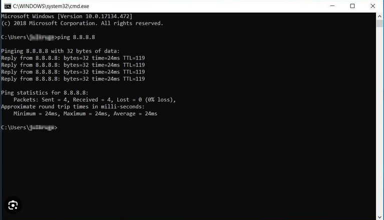
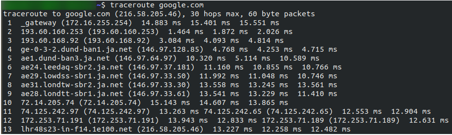
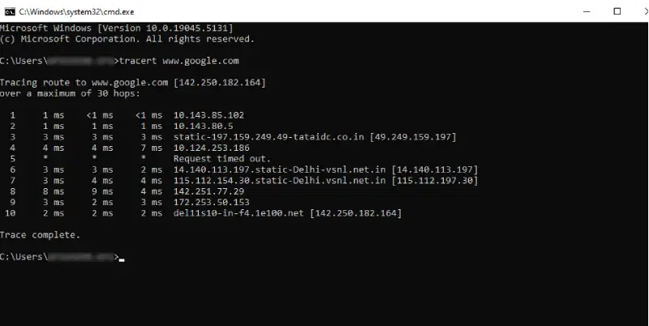
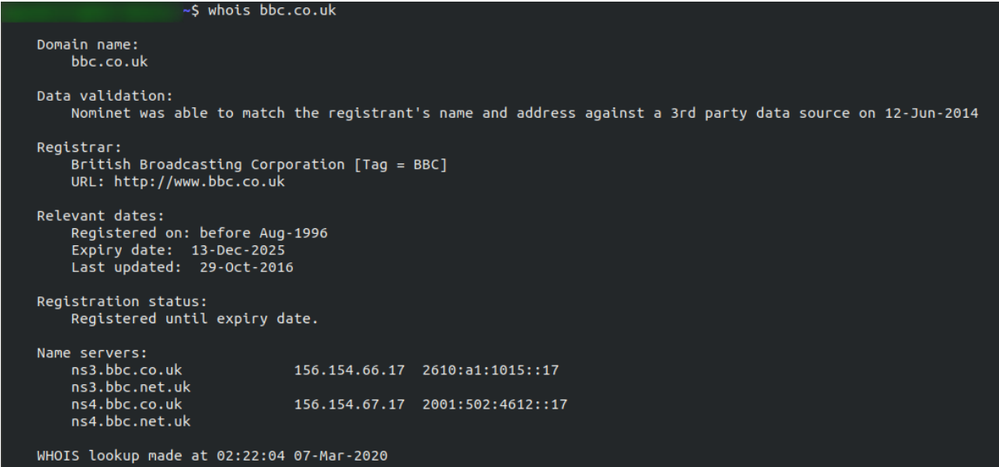

# Intro to Networking

## Objective
Build foundational knowledge of networking concepts and troubleshooting tools.

---

## Key Concepts Learned
- OSI Model vs TCP/IP Model
- How data moves through network layers
- Purpose of common ports (80, 443, 22, etc.)
- Basic network troubleshooting commands

---

## Practical Commands Used

- `ping`
- `traceroute`
- `whois`
- `dig`

---

## What Each Command Does

- **ping** – Tests basic network connectivity using ICMP requests.
- **traceroute** – Displays the route packets take to reach a destination host.
- **whois** – Retrieves domain registration and ownership details.
- **dig** – Performs DNS queries to analyze domain resolution and records.

## Screenshots
(Screenshots will be added below)

---

## Why This Matters for MSP Roles
Understanding networking fundamentals allows IT technicians to diagnose connectivity issues, identify service exposure, and support client network environments effectively.

# Introductory Networking Write-Up

## Room Overview
This room provides foundational knowledge of networking concepts and introduces core tools used for troubleshooting and analysis. The focus is on understanding how data moves across networks and how to verify connectivity and domain resolution.

---

# Task 1 – Introduction

The objective of this room is to build a foundational understanding of networking principles. Networking is essential in cybersecurity and IT because nearly all systems rely on communication between devices. This room introduces the models and tools that explain how that communication works.

## The topics that we're going to cover are:

  - The OSI Model
  - The TCP/IP Model
  - How these models look in practice
  - An introduction to basic networking tools

---

# Task 2 – The OSI Model: An Overview

## OSI Model Diagram & Mnemonic

The OSI (Open Systems Interconnection) Model is a standardized conceptual framework used to understand how data travels across a network. While real-world networking is primarily based on the TCP/IP model, the OSI model provides a clearer theoretical structure for understanding how communication occurs between systems.

The OSI model consists of seven layers:

1. Application  
2. Presentation  
3. Session  
4. Transport  
5. Network  
6. Data Link  
7. Physical  

A common mnemonic used to remember these layers (from Layer 7 to Layer 1) is:

"All People Seem To Need Data Processing" or a fun one that I like is "All People Seem To Need Dominos Pizza"

Each layer plays a specific role in the transmission of data.

---

## Layer 7 – Application

The Application layer provides networking services directly to software applications. It allows programs such as web browsers or email clients to communicate over the network.

This layer does not include the application itself, but rather the protocols that allow the application to send and receive data (e.x., HTTP, FTP, SMTP).

Once data is prepared for transmission, it moves down to the Presentation layer.

---

## Layer 6 – Presentation

The Presentation layer ensures that data is formatted in a standardized way so that it can be understood by the receiving system.

Its responsibilities include:
- Data formatting and translation
- Encryption and decryption
- Compression and decompression

This ensures compatibility between different systems before passing the data to the Session layer.

---

## Layer 5 – Session

The Session layer establishes, maintains, and terminates communication sessions between devices.

It ensures:
- A stable connection is created
- Sessions remain synchronized
- Multiple sessions can operate simultaneously without interference

This layer is essential for managing multiple communications at once, such as browsing multiple websites in separate tabs.

---

## Layer 4 – Transport

The Transport layer is responsible for end-to-end communication and reliability.

Its main functions include:
- Selecting the transmission protocol (TCP or UDP)
- Segmenting data into smaller pieces
- Ensuring data integrity and proper delivery

TCP (Transmission Control Protocol):
- Connection-based
- Reliable
- Ensures packets arrive in order
- Retransmits lost packets

UDP (User Datagram Protocol):
- Connectionless
- Faster
- No guarantee of delivery
- Used where speed is prioritized over reliability (e.g., streaming)

---

## Layer 3 – Network

The Network layer is responsible for logical addressing and routing.

It determines:
- The destination IP address
- The best route for data to travel across networks

Logical addressing (IP addresses) allows devices to be identified and located across interconnected networks. IPv4 (e.g., 192.168.1.1) is the most commonly used format.

---

## Layer 2 – Data Link

The Data Link layer handles physical addressing using MAC addresses.

Responsibilities include:
- Adding the physical (MAC) address of the destination
- Framing data for transmission
- Detecting transmission errors

Each device has a Network Interface Card (NIC) with a unique MAC address assigned by the manufacturer.

This layer ensures data is correctly delivered within a local network segment.

---

## Layer 1 – Physical

The Physical layer deals with the hardware and transmission medium.

It is responsible for:
- Converting binary data into electrical, optical, or radio signals
- Sending signals across cables or wireless connections
- Receiving signals and converting them back into binary

This is the lowest level of networking, focused purely on physical signal transmission.

---

# Task 3 – Encapsulation

## Encapsulation Process Diagram

Encapsulation is the process of adding layer-specific information to data as it moves down through the OSI model before being transmitted across a network.

As data passes through each layer, additional information is added to the beginning of the transmission in the form of headers. These headers contain details relevant to that specific layer.

For example:

- The Transport layer adds information related to the protocol being used (such as TCP or UDP), including port numbers and sequencing data.
- The Network layer adds logical addressing information, such as the source and destination IP addresses.
- The Data Link layer adds physical addressing information (MAC addresses) and also appends a trailer used for error detection.

The trailer added at the Data Link layer helps verify that the data has not been corrupted during transmission. If the data were altered or damaged, this verification process would detect it.

This structured wrapping of data is known as encapsulation.

---

## Naming of Data at Each Layer

As encapsulation occurs, the data is referred to by different names depending on its stage in the process:

- Layers 7, 6, and 5 (Application, Presentation, Session): Data
- Layer 4 (Transport): Segment (TCP) or Datagram (UDP)
- Layer 3 (Network): Packet
- Layer 2 (Data Link): Frame
- Layer 1 (Physical): Bits

By the time the data reaches the Physical layer, it is transmitted as electrical or wireless signals.

---

## De-Encapsulation

When the receiving system gets the transmission, the process is reversed.

Starting at the Physical layer and moving upward:

- The Physical layer converts signals back into binary data.
- The Data Link layer removes the frame header and trailer.
- The Network layer removes the IP header.
- The Transport layer processes port and session information.
- The Application layer receives the original data.

This reverse process is called de-encapsulation.

---

## Why Encapsulation Matters

Encapsulation provides a standardized method for transmitting data between devices. Because all network-enabled systems follow this same structured process, devices from different manufacturers and operating systems can communicate reliably.

This consistency ensures that data sent from one system can be correctly interpreted by another, regardless of platform differences.

Encapsulation and de-encapsulation form the foundation of modern network communication.

# Task 4 – The TCP/IP Model

While the OSI model provides a strong theoretical framework, real-world networking primarily operates using the TCP/IP model.

The TCP/IP model is more streamlined and consists of four layers:

1. Application
2. Transport
3. Internet
4. Network Interface

This model simplifies the seven layers of the OSI model into practical groupings that align with how internet communication actually functions.

---

## Layer Breakdown

### Application Layer

The Application layer combines the OSI Application, Presentation, and Session layers into one.

It handles:
- Web traffic (HTTP/HTTPS)
- Email communication (SMTP)
- File transfers (FTP)
- Domain name resolution (DNS)

This is where applications interact with network services.

---

### Transport Layer

The Transport layer is responsible for end-to-end communication between devices.

It determines:
- Whether TCP (reliable) or UDP (faster, connectionless) is used
- How data is segmented
- Port numbers used for communication

TCP ensures reliable delivery through acknowledgments and retransmissions.  
UDP prioritizes speed over reliability.

---

### Internet Layer

The Internet layer is responsible for logical addressing and routing.

It handles:
- IP addressing
- Packet routing between networks

This layer determines how data moves across interconnected networks, including the internet.

---

### Network Interface Layer

The Network Interface layer corresponds to the lower layers of the OSI model (Data Link and Physical).

It is responsible for:
- Physical transmission of data
- MAC addressing
- Framing

This layer ensures data can move across the local network medium.

---

## Relationship Between OSI and TCP/IP

The OSI model is primarily conceptual and used for learning and troubleshooting.

The TCP/IP model is the practical implementation used in modern networking.

Understanding both models helps technicians:
- Diagnose issues at the correct layer
- Interpret packet captures
- Understand how protocols interact

## TCP Three-Way Handshake

When TCP is selected as the transport protocol, communication begins with a process called the Three-Way Handshake.

This process establishes a reliable connection between two devices before any actual data is transmitted.

The handshake consists of three steps:

### Step 1 – SYN

The client sends a SYN (synchronize) packet to the server.

This packet:
- Requests to start a connection
- Includes an initial sequence number

At this point, the client is asking:  
"Are you available to communicate?"

---

### Step 2 – SYN-ACK

The server responds with a SYN-ACK packet.

This packet:
- Acknowledges the client’s SYN request
- Sends its own SYN request back to the client

The server is essentially replying:  
"I received your request, and I’m ready."

---

### Step 3 – ACK

The client sends an ACK (acknowledgment) packet back to the server.

This confirms:
- The server’s response was received
- The connection is officially established

At this point, data transmission can begin.

---

## Why the Three-Way Handshake Matters

The TCP handshake ensures:

- Both devices are ready to communicate
- Sequence numbers are synchronized
- Reliable, ordered data delivery can occur
- Lost packets can be detected and retransmitted

This reliability is why TCP is used for:

- Web browsing (HTTP/HTTPS)
- File transfers
- Email communication
- Secure connections

Understanding the TCP handshake is important for troubleshooting connectivity issues and analyzing packet captures in tools such as Wireshark.

### UDP (User Datagram Protocol)

UDP is a connectionless transport protocol designed for speed and efficiency.

Unlike TCP, UDP does not establish a connection before sending data. There is no handshake process, no acknowledgment of received packets, and no retransmission of lost data.

When data is sent over UDP:
- It is transmitted immediately.
- There is no guarantee it will arrive.
- There is no guarantee it will arrive in order.
- There is no built-in error recovery.

Because UDP has minimal overhead, it is significantly faster than TCP. It does not spend time confirming delivery or managing sequence numbers.

UDP is ideal in situations where:
- Speed is more important than perfect accuracy.
- Small amounts of data are transmitted frequently.
- Occasional packet loss is acceptable.

Common uses of UDP include:
- Video streaming
- Online gaming
- Voice over IP (VoIP)
- DNS queries

For example, in video streaming, losing a single packet may cause a brief visual glitch, but retransmitting that packet would take too long and interrupt playback. In this case, speed is more important than reliability.

UDP sacrifices reliability for performance, making it efficient but less controlled than TCP.

## Common Ports 

Common well-known ports include:

- **Port 20/21 (FTP)** – File Transfer Protocol  
- **Port 22 (SSH)** – Secure remote login  
- **Port 23 (Telnet)** – Unencrypted remote login  
- **Port 25 (SMTP)** – Email transmission  
- **Port 53 (DNS)** – Domain name resolution  
- **Port 80 (HTTP)** – Unencrypted web traffic  
- **Port 443 (HTTPS)** – Encrypted web traffic  
- **Port 110 (POP3)** – Email retrieval  
- **Port 143 (IMAP)** – Email retrieval and management  
- **Port 3389 (RDP)** – Remote Desktop Protocol  

Ports are divided into ranges:

- 0–1023: Well-known ports (standard services)
- 1024–49151: Registered ports
- 49152–65535: Dynamic or private ports

Ports are numerical identifiers used at the Transport layer to direct traffic to the correct service on a device. While an IP address identifies the host, the port number identifies the specific application or service running on that host. Understanding common ports is important for troubleshooting, firewall configuration, and identifying exposed services during network analysis. For example, if port 80 or 443 is open on a host, it typically indicates a web service is running. If port 22 is open, SSH access may be enabled.

# Task 5 – Ping

The `ping` command is a basic network troubleshooting tool used to test connectivity between two devices.

It works by sending ICMP (Internet Control Message Protocol) Echo Request packets to a target host and waiting for an Echo Reply.

If the target responds, it confirms:

- The device is reachable
- Network connectivity exists
- DNS resolution may be functioning (if a domain name is used)

---

## Ping Example Command

---

## What Ping Output Shows

When running the command, the output typically displays:

- The resolved IP address of the domain
- The time it takes for packets to travel (latency)
- The number of packets sent and received
- Whether any packets were lost

Key indicators include:

- **Reply from** – The target responded successfully.
- **Time=XX ms** – Round-trip latency in milliseconds.
- **Packet loss** – Indicates possible connectivity issues.

---

## Why Ping Matters

Ping is often the first step in troubleshooting network problems.

It helps determine:

- If a host is online
- If there is a routing issue
- If DNS resolution is working
- If there is high latency or packet loss

If ping fails, it can indicate:

- The host is offline
- A firewall is blocking ICMP
- A routing issue exists
- DNS is not resolving properly

Ping provides a quick way to verify basic network communication before moving to more advanced diagnostics.

## Testing by Domain vs IP Address

Ping can be used with either a domain name or a direct IP address.

Example:

ping tryhackme.com  
ping 8.8.8.8  

If ping works with an IP address but fails with a domain name, this may indicate a DNS resolution issue rather than a network connectivity problem.

## Packet Loss and Latency

Two important values displayed in ping output are:

- **Latency (ms)** – The round-trip time for packets.
- **Packet Loss (%)** – The percentage of packets that did not return.

High latency can indicate network congestion or routing delays.

Packet loss may suggest:
- Network instability
- Hardware issues
- Wireless interference
- Firewall filtering

## Limitations of Ping

Ping relies on ICMP, which may be disabled or blocked by firewalls.

If a host does not respond to ping, it does not always mean the system is offline. It may simply be configured not to respond to ICMP requests.

# Task 6 – Traceroute / Tracert

The `traceroute` (Linux/macOS) and `tracert` (Windows) commands are used to identify the path that packets take from a source device to a destination host.

While the command name differs between operating systems, the purpose and functionality remain the same.

These tools allow technicians to see each intermediate router (hop) that forwards traffic along the route to its destination.

---

## Screenshot Example Commands

# Linux / macOS: traceroute 

## Traceroute Output Explanation

The traceroute output shows the path taken from the local machine to google.com (216.58.205.46).

Each numbered line represents a hop — a router or intermediary device that forwards the packet toward its destination.

For example:

- Hop 1 (_gateway – 172.16.255.254) is the local network gateway.
- Subsequent hops show ISP infrastructure and backbone routers.
- The final hop (lhr48s23-in-f14.1e100.net – 216.58.205.46) is Google's server.

Each hop displays three time measurements (in milliseconds). These represent round-trip latency for three probe packets sent to that router.

Lower numbers indicate faster response times. Sudden increases in latency may suggest congestion or distance-related delay.

If a hop displayed asterisks (*), it would indicate that the router did not respond to the probe, often due to firewall filtering or ICMP restrictions.

This output confirms:

- Network connectivity exists
- Routing is functioning properly
- The full path to the destination can be observed
- Latency remains relatively stable across hops

The final hop confirms successful communication with the target server.

# Windows: tracert 

## Tracert (Windows) Output Explanation

This output shows the Windows equivalent of traceroute using the `tracert` command.

The route is traced from the local Windows machine to www.google.com (142.250.182.164).

Each numbered line represents a hop — a router that forwards traffic toward the final destination.

Key observations:

- The first hop (10.143.85.102) is typically the local gateway or internal router.
- Subsequent hops show ISP and backbone routing infrastructure.
- The final hop (del11s10-in-f4.1e100.net – 142.250.182.164) confirms arrival at Google’s server.
- “Trace complete.” indicates successful path discovery.

Each hop displays three latency measurements in milliseconds. These represent the round-trip time for probe packets.

Consistent low latency suggests stable routing. Significant spikes may indicate congestion or longer geographic distance.

This confirms:

- Network routing is functioning correctly.
- The destination host is reachable.
- The full path can be analyzed for performance or troubleshooting.

The Windows `tracert` command performs the same core function as Linux `traceroute`, demonstrating cross-platform network diagnostics.

---

## How Traceroute Works

Traceroute operates by manipulating the TTL (Time To Live) value inside IP packets.

TTL limits how many hops a packet can travel before being discarded.

The process works as follows:

1. A packet is sent with TTL set to 1.
2. The first router decreases TTL to 0 and discards the packet.
3. That router sends back an ICMP "Time Exceeded" message.
4. The sender records that router as Hop 1.
5. The TTL is increased to 2, and the process repeats.

By gradually increasing TTL values, traceroute maps each hop between the source and destination.

---

## What the Output Shows

The output typically includes:

- Hop number
- IP address or hostname of each router
- Round-trip time (latency) for each attempt

Multiple time measurements are displayed to show consistency.

Asterisks (*) may appear if a router does not respond.

---

## Why This Matters in IT and MSP Roles

Traceroute is useful for:

- Identifying where traffic is being delayed
- Diagnosing routing issues
- Determining whether a problem exists internally or with an ISP
- Investigating intermittent connectivity problems

For example:

If ping fails but traceroute reaches several hops before stopping, the issue may exist beyond the local network.

If latency spikes at a specific hop, it may indicate congestion at that router.

---

## Limitations

- Some routers block ICMP responses, which may show as timeouts.
- The outbound path may not match the return path.
- A successful traceroute does not guarantee application-layer functionality.

# Task 7 – WHOIS

The `whois` command is used to retrieve publicly available registration information about a domain name.

When a domain is registered, details about its ownership and administrative information are stored in a WHOIS database. This database can be queried to gather information about the domain’s registrar and associated infrastructure.

---

## Example Command

# WHOIS 

## WHOIS Output Explanation

This WHOIS query was performed on the domain bbc.co.uk.

The output provides publicly available registration information about the domain.

Key observations:

- **Registrar:** British Broadcasting Corporation (BBC)  
  This identifies the organization that owns or manages the domain.

- **Registration Date:** Before Aug-1996  
  This indicates the domain has existed for a long time, suggesting legitimacy and established ownership.

- **Expiry Date:** 13-Dec-2025  
  This shows when the domain registration is set to expire.

- **Registration Status:** Registered until expiry date  
  This confirms the domain is currently active.

- **Name Servers:**  
  ns3.bbc.co.uk  
  ns4.bbc.co.uk  
  These are the authoritative DNS servers responsible for resolving the domain.

The WHOIS lookup confirms that this is a legitimate, long-standing domain owned by a recognized organization.

In a security context, WHOIS data can help determine whether a domain is newly registered, suspicious, or associated with known infrastructure. Older domains with consistent ownership are typically less likely to be malicious compared to newly created domains often used in phishing campaigns.

---

## What WHOIS Provides

A WHOIS lookup may include:

- Domain registrar
- Creation and expiration dates
- Name servers
- Administrative or technical contact details
- Domain status (active, clientTransferProhibited, etc.)

Some domains use privacy protection services, which hide personal registrant details.

---

## Why WHOIS Matters in IT and Security

WHOIS is useful for:

- Identifying domain ownership
- Verifying legitimacy of a website
- Investigating suspicious domains
- Understanding infrastructure relationships
- Determining domain expiration timelines

For example:

If a client reports a suspicious email, checking the sender’s domain registration date may reveal that it was recently created — a common indicator of phishing campaigns.

WHOIS provides context about who controls a domain and how long it has existed.

---

## Limitations

- Many domains use privacy protection, masking registrant details.
- WHOIS does not provide real-time threat intelligence.
- Information may be limited depending on registry policies.

WHOIS is an investigative starting point rather than a complete security solution.

