# Windows Security Controls Lab

## Objective

## Tools Used

The following tools were utilized to configure and validate Windows Defender security controls:

| Tool | Purpose |
|------|---------|
| Windows Security | GUI-based antivirus configuration and scan management |
| Windows Terminal (Admin) | Elevated administrative access for security validation |
| PowerShell | Command-line verification of Defender status and signature updates |

This lab focuses on configuring and understanding built-in Windows security controls relevant to IT support and MSP environments.

The goal is to demonstrate hands-on experience managing endpoint security settings, user controls, and system protection mechanisms.

---

## Topics Covered

- Windows Defender Antivirus Configuration
- Windows Firewall with Advanced Security
- Local User Account Management
- User Account Control (UAC)
- Encrypting File System (EFS)
- NTFS Permissions
- Local Security Policy
- Command Line Security Tools

---

## Lab Environment

- Windows 10 / 11 (Virtual Machine)
- Local Administrator Access

---

## Relevance to IT / MSP Roles

This lab demonstrates practical endpoint administration and system hardening skills that are essential for:

- Help Desk Support
- MSP Technician Roles
- Junior System Administration
- Endpoint Security Management

Each section below documents the configuration process, screenshots, and analysis of security impact.

# Task 1 – Configure Windows Defender Antivirus Settings

## Objective

Review and configure Windows Defender Antivirus settings to ensure real-time protection and threat mitigation are properly enabled on a Windows workstation.

---

## Steps Performed

1. Opened **Windows Security** from the Start menu.
2. Navigated to **Virus & Threat Protection**.
3. Reviewed current protection status.
4. Verified that:
   - Real-time protection is enabled
   - Cloud-delivered protection is enabled
   - Automatic sample submission is enabled
5. Opened **Virus & Threat Protection Settings** to confirm configuration.

---

## Security Features Reviewed

### Real-Time Protection
Monitors files and programs for malicious activity as they are accessed.

### Cloud-Delivered Protection
Uses Microsoft’s cloud intelligence to detect emerging threats.

### Automatic Sample Submission
Sends suspicious files to Microsoft for deeper analysis.

---

## Why This Matters

Windows Defender is the first line of defense against malware on endpoint systems.

Ensuring these protections are enabled:

- Reduces malware infection risk
- Prevents unauthorized software execution
- Strengthens baseline endpoint security
- Supports compliance with security best practices

In MSP environments, verifying endpoint antivirus configuration is a common support task.

## Step-by-Step Configuration and Validation Process

### Step 1: Access the Windows Desktop

The system is booted into a Windows 11 environment.  
This represents a typical client workstation in a real-world MSP environment.

---

## Step 2: Open the Start Menu

The Start button is selected from the taskbar.

This is the standard method for accessing system applications and administrative tools.

---

## Step 3: Search for Windows Security

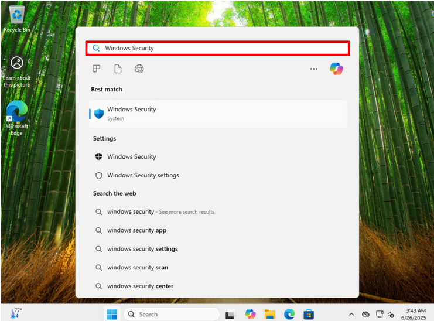

"Windows Security" is typed into the search bar.

Using search allows quick access to security tools without navigating through Control Panel or Settings menus — a common time-saving practice in IT support environments.

---

## Step 4: Open Virus & Threat Protection

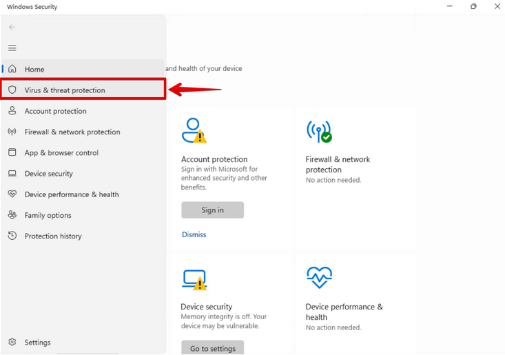

Inside Windows Security, **Virus & Threat Protection** is selected.

This section controls Microsoft Defender Antivirus and handles:

- Malware detection
- Threat scanning
- Real-time protection
- Scan history

In MSP environments, this is one of the first places technicians check when investigating suspected malware.

---

## Step 5: Run a Quick Scan

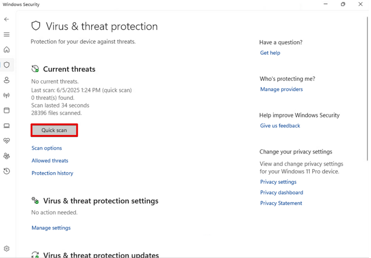

The **Quick Scan** option is selected.

A quick scan checks common infection locations such as:

- Running processes
- System memory
- Startup locations
- Critical system folders

Real-World Importance:
Quick scans are often performed during routine maintenance or when a client reports unusual system behavior.

---

## Step 6: Monitor Scan Progress

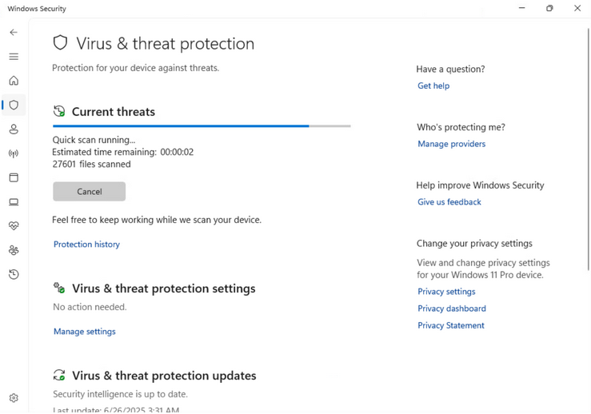

The scan runs and displays:

- Files scanned
- Estimated time remaining

This confirms that antivirus definitions are functioning properly and that the engine is actively scanning.

In real-world support, verifying scan execution ensures that endpoint protection has not been disabled or corrupted.

---

## Step 7: Access Virus & Threat Protection Settings

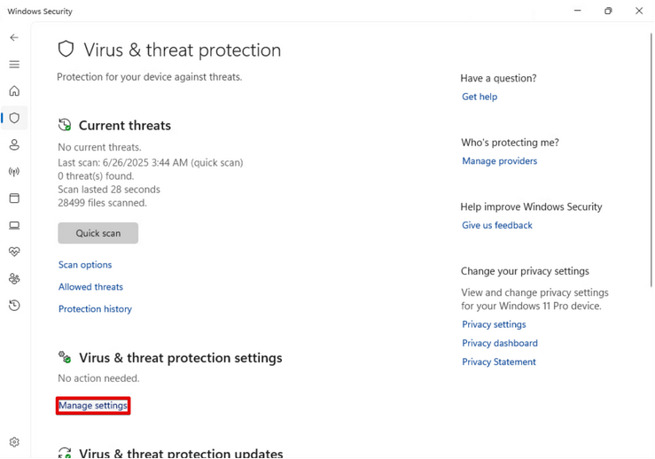

"Manage settings" is selected under Virus & Threat Protection settings.

This is where core Defender protections are configured.

---

## Step 8: Verify Real-Time Protection

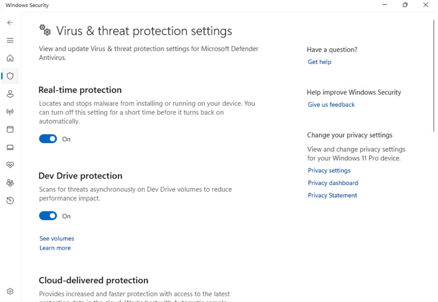

Real-Time Protection is confirmed as **ON**.

Real-Time Protection is critical because:

- It actively monitors file activity.
- It blocks malicious programs before execution.
- It prevents zero-day threats from running unchecked.

If Real-Time Protection is disabled in a production environment, the endpoint becomes significantly vulnerable.

MSP technicians frequently verify this setting when onboarding new devices or investigating security incidents.

---

## Step 9: Navigate Back to Main Threat Page

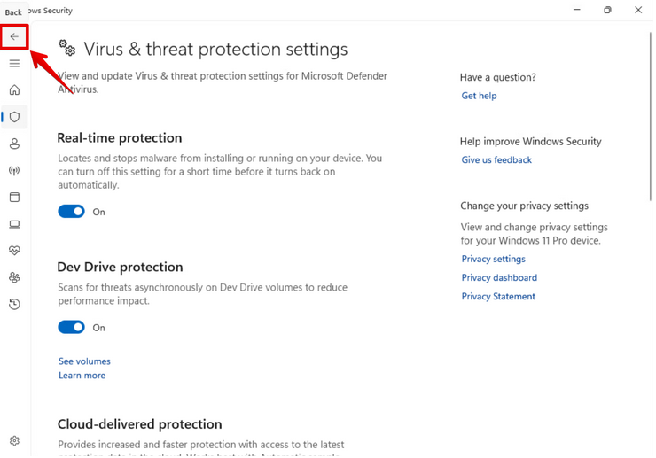

The back arrow is selected to return to the main Virus & Threat Protection dashboard.

This ensures proper navigation and confirms no configuration errors occurred.

---

## Step 10: Open Scan Options

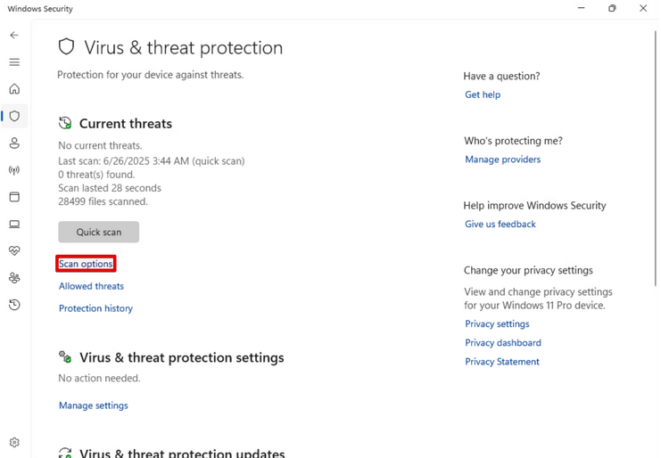

"Scan options" is selected.

This allows selection of:

- Quick Scan
- Full Scan
- Custom Scan
- Microsoft Defender Offline Scan

---

## Step 11: Perform a Full Scan

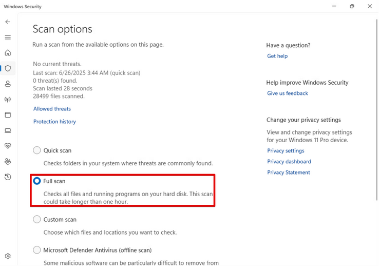

The **Full Scan** option is selected.

A full scan checks:

- All files
- All running programs
- Entire hard drive contents

Real-World Importance:
Full scans are used when:

- Persistent malware is suspected
- A quick scan returns suspicious behavior
- A system shows performance degradation
- A machine is being prepared for production use

---

## Step 12: Execute Full Scan

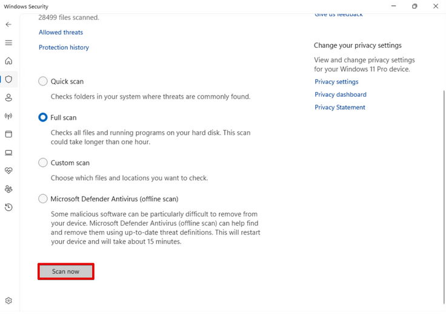

"Scan now" is selected to begin the full system scan.

The scan progress confirms:

- Antivirus engine is operational
- Definitions are updated
- System integrity is being evaluated

In enterprise environments, scheduled full scans are often configured via Group Policy or endpoint management platforms.

---

### Step 13: Open Windows Terminal (Admin)

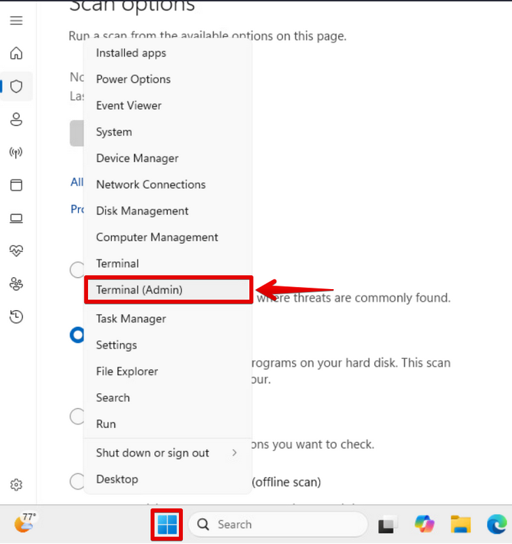

The Start button is right-clicked and **Terminal (Admin)** is selected.

This opens Windows Terminal with administrative privileges.

Real-World Importance:

Many security and system validation tasks require elevated privileges.  
Running as Administrator ensures access to Defender services and system-level configurations.

In MSP environments, technicians frequently escalate to admin terminals to verify system health, run diagnostic commands, and perform remediation tasks.

---

## Step 14: User Account Control (UAC) Prompt

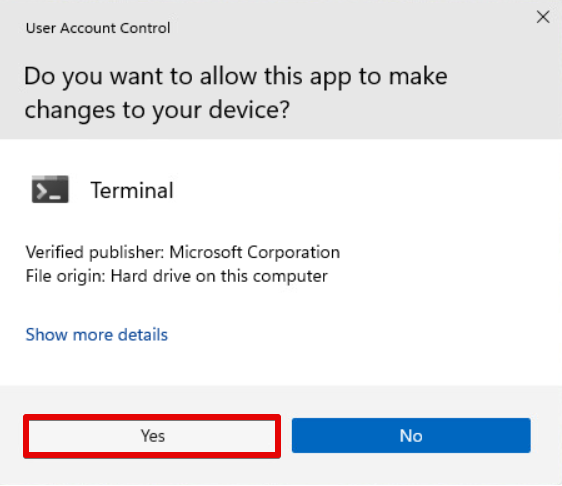

A User Account Control (UAC) prompt appears asking:

"Do you want to allow this app to make changes to your device?"

Selecting **Yes** grants elevated administrative access.

Real-World Importance:

UAC prevents unauthorized privilege escalation.  
This confirms:

- The account has administrative rights
- Privileged commands are being executed intentionally

In production environments, UAC acts as a security boundary to prevent silent malware elevation.

---

## Step 15: Verify Defender Status Using PowerShell

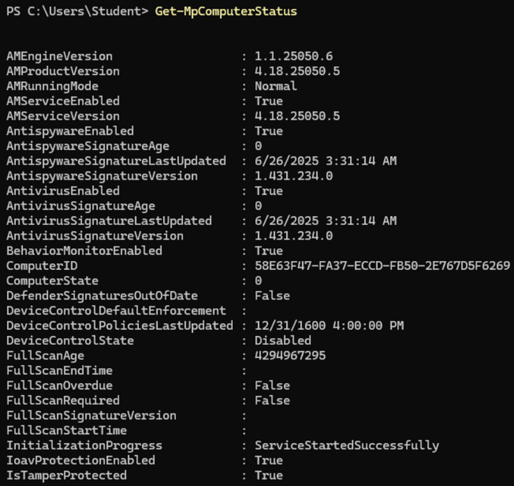

Get-MpComputerStatus

This PowerShell cmdlet retrieves the current operational status of Microsoft Defender.

The output provides:

- AntivirusEnabled
- AntispywareEnabled
- RealTimeProtectionEnabled
- BehaviorMonitorEnabled
- AntivirusSignatureLastUpdated
- Engine and Product Version
- Tamper Protection status

What This Confirms:

- Defender services are running
- Real-time protection is active
- Signatures are current
- No service corruption exists
- Tamper protection is enabled

Real-World Importance:

This command is extremely valuable in enterprise environments.

Rather than relying on GUI indicators, technicians can:

- Script validation checks
- Remotely verify Defender status
- Confirm compliance baselines
- Detect disabled security services

This is commonly used in PowerShell automation, RMM platforms, and security audits.

---

## Step 16: Update Defender Signatures

Update-MpSignature

This forces Microsoft Defender to download the latest malware definition updates.

Why This Matters:

Malware detection depends heavily on updated threat definitions.

Outdated signatures increase risk of infection.

In MSP environments:

- This command may be run after malware detection
- Used during onboarding of new systems
- Performed during security maintenance windows

Ensuring up-to-date signatures is part of baseline endpoint security hygiene.

---

## Step 17: Initiate Quick Scan via PowerShell

Start-MpScan -ScanType QuickScan

This starts a quick malware scan from the command line.

Why Use PowerShell Instead of GUI?

- Enables automation
- Can be executed remotely
- Allows scripting across multiple machines
- Integrates with management tools

In enterprise environments, this is often deployed via:

- PowerShell remoting
- RMM tools
- Group Policy scripts
- Endpoint management platforms

---

### Security Validation Summary (Advanced Level)

By using PowerShell commands, this task demonstrates:

- Ability to verify endpoint protection programmatically
- Understanding of Defender operational state
- Knowledge of signature management
- Familiarity with security automation concepts
- Administrative command-line proficiency

This moves beyond basic GUI usage and demonstrates enterprise-ready troubleshooting capability.

# Lab Conclusion

This lab demonstrates practical configuration and validation of built-in Windows security controls using both graphical and command-line methods.

Through this process, I:

- Verified Microsoft Defender real-time protection status
- Executed quick and full system scans
- Confirmed antivirus signature updates
- Validated Defender operational health using PowerShell
- Demonstrated administrative privilege management through UAC

By using both the Windows Security interface and PowerShell cmdlets (Get-MpComputerStatus, Update-MpSignature, Start-MpScan), I showed the ability to perform endpoint security validation at both a basic support level and a more advanced administrative level.

From a real-world MSP perspective, these tasks reflect common responsibilities such as:

- Verifying antivirus health during onboarding
- Investigating suspected malware activity
- Ensuring endpoint compliance with security baselines
- Running remote security checks using command-line tools
- Maintaining updated threat definitions

This lab reflects hands-on experience performing real-world endpoint security validation and configuration. It demonstrates not only familiarity with Windows Defender settings, but also the ability to verify and manage security controls using administrative tools and PowerShell — skills directly applicable to MSP, help desk, and junior system administration roles.

