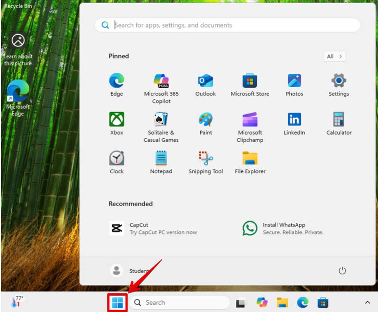

# Windows Firewall with Advanced Security

## Objective
Create a custom inbound firewall rule to allow TCP traffic on Port 80 (HTTP) using Windows Defender Firewall with Advanced Security.

This lab demonstrates controlled service exposure, port-level access management, and endpoint hardening practices used in enterprise environments.

---

## Environment
- Windows 11 Pro
- Windows Defender Firewall with Advanced Security (wf.msc)
- Local Administrator privileges
- Standalone workstation (non-domain joined)

---

### Step 1: Open Start Menu

The **Start button** is clicked to access system administrative tools.

This is the primary entry point for launching management consoles and configuration utilities in Windows.

Real-World Importance:

IT technicians frequently access system tools from the Start menu when troubleshooting, configuring services, or responding to tickets. Knowing quick access methods improves response time in support and security operations environments.

---

### Step 2: Launch Windows Defender Firewall with Advanced Security (wf.msc)

The command `wf.msc` is typed into the search bar and opened.

This launches the **Windows Defender Firewall with Advanced Security MMC console**, which provides granular firewall rule configuration beyond the basic Windows Security interface.

Technical Insight:

The advanced console allows administrators to:
- Create port-based rules
- Create program-based rules
- Configure inbound and outbound traffic
- Assign rules to specific network profiles
- Enforce IPSec policies

Real-World Importance:

In enterprise environments, firewall management is critical for endpoint hardening. Security teams use this console (or Group Policy equivalents) to reduce attack surface and control network exposure.

---

### Step 3: Select Inbound Rules

The **Inbound Rules** section is selected from the left panel.

Inbound rules control traffic entering the system from external hosts.

Technical Insight:

Inbound filtering is crucial because exposed listening services can be discovered through port scanning tools such as Nmap. Any open port represents a potential entry point.

Real-World Importance:

Workstations should have minimal inbound exposure. Servers may require specific inbound rules for business services. Reviewing inbound rules ensures only required services are accessible.

---

### Step 4: Create a New Inbound Rule

The **New Rule** option is selected from the Actions panel.

This initiates the New Inbound Rule Wizard.

Real-World Importance:

Creating controlled rules is part of service deployment, troubleshooting blocked applications, and implementing security baselines.

---

### Step 5: Select Rule Type – Port

The **Port** rule type is selected.

This creates a rule that controls traffic based on TCP or UDP port numbers.

Technical Insight:

Port-based rules filter traffic at the transport layer (Layer 4). This is essential when managing services that rely on known ports.

Real-World Importance:

Administrators often allow only required ports such as:
- 80 (HTTP)
- 443 (HTTPS)
- 3389 (RDP)
- 22 (SSH)

Restricting traffic by port reduces attack surface.

---

### Step 6: Configure Protocol and Port

Selected:
- TCP
- Specific local ports: 80

Port 80 is used for HTTP web traffic.

Technical Insight:

TCP is connection-oriented and ensures reliable data transmission. HTTP relies on TCP to guarantee packet delivery.

Specifying a single local port ensures that only traffic targeting port 80 is allowed.

Real-World Importance:

Opening only necessary ports follows the **Principle of Least Privilege**. Overly broad firewall rules increase exposure to unauthorized access or exploitation.

---

### Step 7: Choose Action – Allow the Connection

The option **Allow the connection** is selected.

This permits inbound traffic that matches the defined rule.

Technical Insight:

Alternative options include:
- Allow the connection if secure (IPSec enforced)
- Block the connection

Allowing unsecured connections permits traffic without additional authentication.

Real-World Importance:

Security teams must balance availability and protection. Allowing services without encryption (HTTP instead of HTTPS) may introduce security risks if sensitive data is transmitted.

---

### Step 8: Assign Network Profiles

Selected:
- Domain
- Private
- Public

Technical Insight:

Windows applies firewall rules based on network profile:
- Domain: Corporate Active Directory environment
- Private: Trusted home or internal networks
- Public: Untrusted networks (airports, cafés, hotels)

Real-World Importance:

Profile selection is critical. Allowing HTTP on Public networks could expose a device when connected to open Wi-Fi. In enterprise environments, profile-based restrictions are commonly enforced via Group Policy.

---

### Step 9: Name the Rule

The rule is named:

Allow HTTP

Technical Insight:

Clear naming conventions improve rule management and auditing.

Real-World Importance:

In enterprise environments, firewall rules are audited for compliance and security reviews. Descriptive naming reduces confusion and simplifies troubleshooting.

Example enterprise naming convention:
ALLOW_HTTP_TCP80_DOMAIN

---

### Step 10: Confirm Rule Creation

The rule appears under Inbound Rules and is enabled.

This confirms:
- The rule is active
- The profile assignment is correct
- Traffic on TCP port 80 is now permitted inbound

Real-World Importance:

Validation is essential before closing change requests or support tickets. Failure to verify firewall rules can lead to service outages or unintended exposure.

---

