# Windows Firewall with Advanced Security

## Objective
Create a custom inbound firewall rule to allow TCP traffic on Port 80 (HTTP) using Windows Defender Firewall with Advanced Security.

This lab demonstrates controlled service exposure, transport-layer filtering, rule-based traffic management, and endpoint hardening practices commonly implemented in enterprise IT environments.

---

## Environment
- Windows 11 Pro
- Windows Defender Firewall with Advanced Security (wf.msc)
- Local Administrator privileges
- Standalone workstation (non-domain joined)

---

### Step 1: Open Start Menu

The **Start button** is clicked to access system administrative tools.

The Start menu serves as the primary launch interface for system utilities, management consoles, and administrative tools within Windows.

#### Technical Context:

Windows integrates many management snap-ins (MMC consoles) that can be launched directly via search. Administrators often use this method for rapid tool access without navigating deep into Control Panel or Settings menus.

#### Real-World Importance:

In enterprise environments, efficiency matters. Help desk technicians and system administrators frequently access tools such as:
- Event Viewer
- Services (services.msc)
- Device Manager
- Firewall console (wf.msc)

Quick access reduces troubleshooting time and improves response speed during incident handling or system configuration tasks.

---

### Step 2: Launch Windows Defender Firewall with Advanced Security (wf.msc)

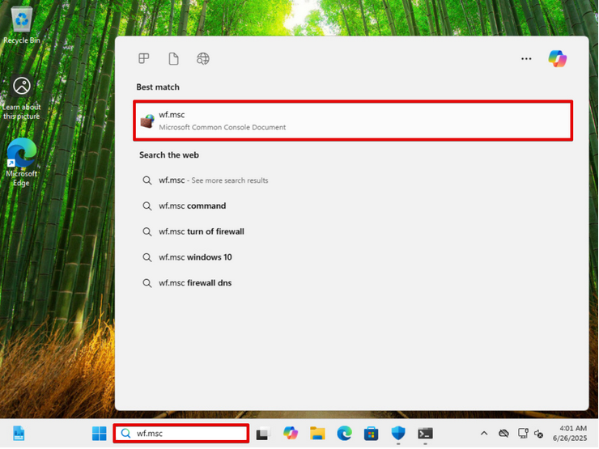

The command `wf.msc` is entered into the search bar and executed.

This opens the **Windows Defender Firewall with Advanced Security MMC console**, which provides granular rule-level configuration capabilities.

#### Technical Insight:

The advanced firewall console allows administrators to:

- Create inbound and outbound filtering rules
- Filter by port, protocol, program, or predefined service
- Apply rules based on network profile
- Configure IPSec security policies
- Control logging and monitoring behavior

This console operates at Layer 3 and Layer 4 of the OSI model (Network and Transport layers).

#### Real-World Importance:

In enterprise environments, firewall rules are rarely managed through the basic Windows Security interface. Instead:

- Security baselines are enforced through Group Policy
- Endpoint rules are audited for compliance
- Port exposure is tightly controlled to reduce attack surface

Understanding this console demonstrates practical endpoint security administration skills.

---

### Step 3: Select Inbound Rules

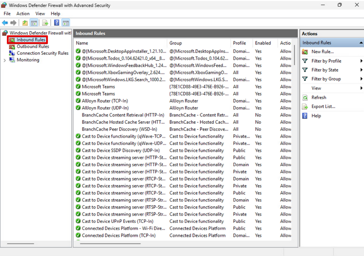

The **Inbound Rules** section is selected from the left navigation pane.

Inbound rules control traffic entering the local system from external hosts.

#### Technical Insight:

Inbound filtering determines which services on the machine are reachable from the network.

If a port is listening and allowed through the firewall:
- It can be discovered via port scanning (e.g., Nmap)
- It may become an attack vector
- It increases system exposure

Each inbound rule corresponds to traffic evaluated against:
- Protocol (TCP/UDP)
- Port number
- Network profile
- Action (Allow/Block)

#### Real-World Importance:

In enterprise security strategy:

- Workstations should have minimal inbound exposure
- Servers expose only required business services
- Firewall audits verify that only authorized ports are open

Improper inbound configuration is one of the most common causes of unnecessary attack surface.

---

### Step 4: Create a New Inbound Rule

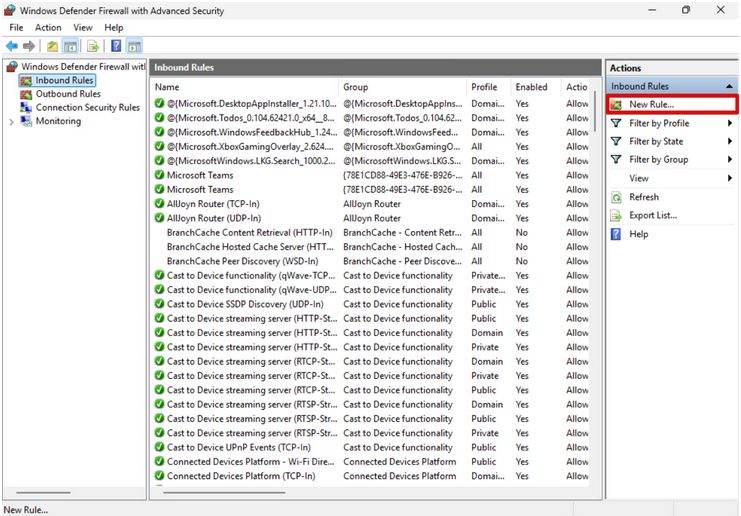

The **New Rule** option is selected from the Actions panel.

This launches the New Inbound Rule Wizard.

#### Technical Insight:

Creating a rule initiates structured policy configuration:

1. Rule Type
2. Protocol and Port
3. Action
4. Profile Scope
5. Naming and Documentation

This ensures firewall rules are created methodically and consistently.

#### Real-World Importance:

In production environments:

- Firewall changes often require change management approval
- Documentation must justify why a port is being opened
- Misconfigured rules can lead to data exposure or service outages

Understanding rule creation demonstrates controlled access implementation.

---

### Step 5: Select Rule Type – Port

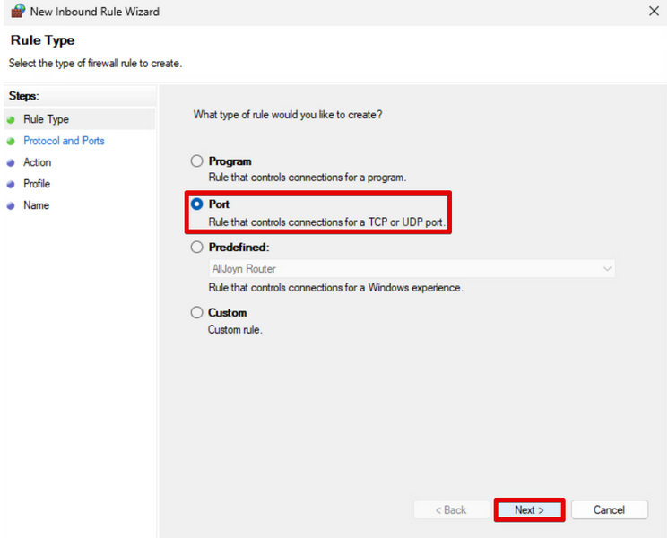

The **Port** rule type is selected.

This defines filtering based on TCP or UDP port numbers.

#### Technical Insight:

Port-based rules operate at Layer 4 (Transport Layer).

Each service communicates over specific ports:
- HTTP → TCP 80
- HTTPS → TCP 443
- RDP → TCP 3389
- SSH → TCP 22

Filtering by port allows administrators to expose only the exact service required.

#### Real-World Importance:

Port-level filtering is fundamental in:

- Web server deployments
- Remote access configuration
- Application hosting
- Security segmentation

Allowing only necessary ports aligns with the **Principle of Least Privilege**, reducing system exposure.

---

### Step 6: Configure Protocol and Port

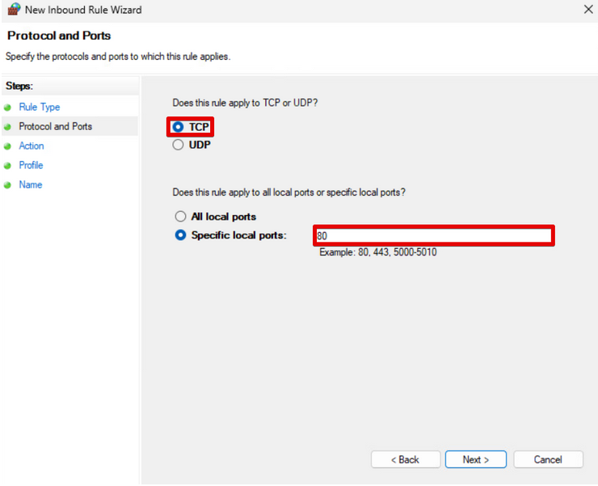

Selections made:
- Protocol: TCP
- Specific Local Port: 80

Port 80 is designated for HTTP traffic.

#### Technical Insight:

TCP (Transmission Control Protocol) is:

- Connection-oriented
- Reliable
- Ordered
- Acknowledgment-based

HTTP depends on TCP to ensure reliable delivery of web content.

Specifying "Specific local ports: 80" ensures:

- Only traffic targeting TCP port 80 is allowed
- No other ports are unintentionally exposed

#### Real-World Importance:

Overly broad rules such as "All local ports" significantly increase risk.

In enterprise audits, security teams verify:

- Only required ports are exposed
- Rules are tightly scoped
- No unnecessary listening services exist

Proper port scoping demonstrates disciplined firewall management.

---

### Step 7: Choose Action – Allow the Connection

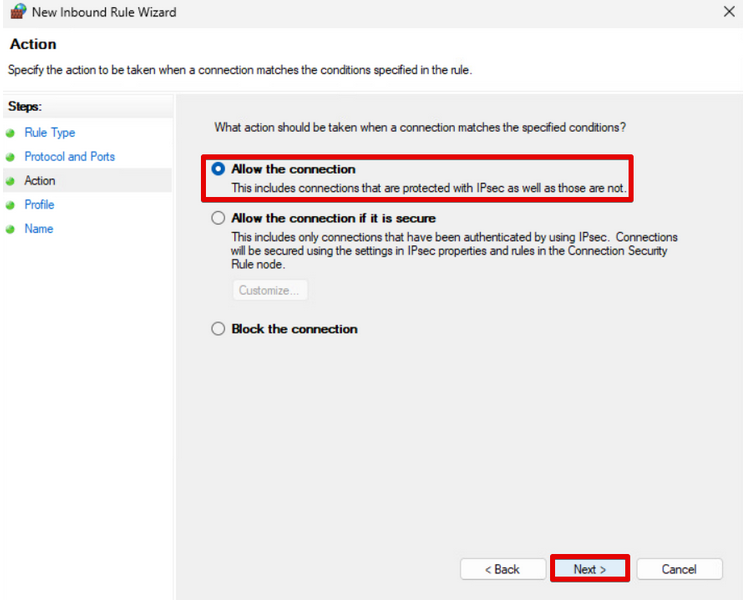

The option **Allow the connection** is selected.

#### Technical Insight:

Firewall actions include:

- Allow the connection
- Allow if secure (IPSec authenticated)
- Block the connection

Choosing "Allow the connection" permits inbound traffic without requiring IPSec authentication.

#### Real-World Consideration:

Allowing unencrypted HTTP (port 80) may introduce security risks:

- Traffic is not encrypted
- Data can be intercepted (Man-in-the-Middle attacks)
- Credentials transmitted over HTTP are exposed

In modern enterprise environments, HTTP is typically redirected to HTTPS (port 443) for secure encrypted communication.

This step demonstrates how security decisions directly impact risk posture.

---

### Step 8: Assign Network Profiles

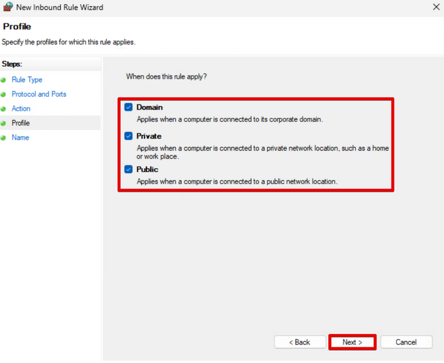

Selected profiles:
- Domain
- Private
- Public

#### Technical Insight:

Windows applies firewall rules based on network location awareness:

- **Domain Profile** → Corporate Active Directory networks
- **Private Profile** → Trusted internal/home networks
- **Public Profile** → Untrusted networks (airports, hotels, cafés)

Firewall behavior changes dynamically depending on detected profile.

#### Real-World Importance:

This step is critical.

Allowing port 80 on the Public profile means:

If the laptop connects to open Wi-Fi, HTTP remains exposed.

In enterprise best practice:
- Sensitive services are often limited to Domain profile only.
- Public exposure is minimized.
- Group Policy may override local firewall settings.

Understanding profile scope demonstrates awareness of contextual security controls.

---

### Step 9: Name the Rule

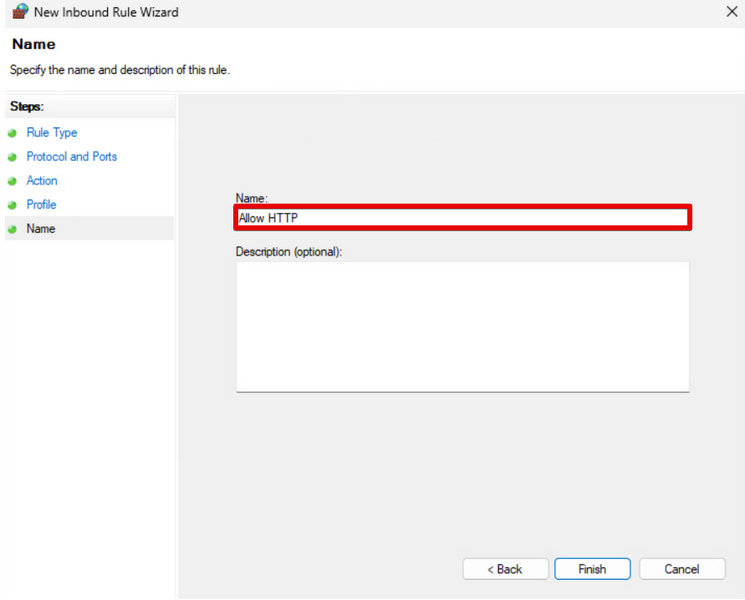

Rule name entered:

Allow HTTP

#### Technical Insight:

Clear naming conventions improve:

- Auditing
- Troubleshooting
- Change management tracking

Enterprise naming examples:
- ALLOW_HTTP_TCP80_DOMAIN
- WEB_SVC_TCP80_INBOUND
- PROD_APP01_HTTP_ALLOW

#### Real-World Importance:

Security audits frequently review firewall rule sets.

Poor naming conventions cause confusion and increase misconfiguration risk.

Proper documentation is part of operational maturity in enterprise IT environments.

---

### Step 10: Confirm Rule Creation

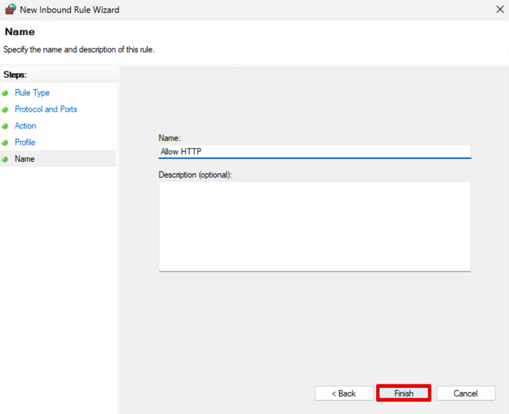

The rule appears in the Inbound Rules list and is enabled.

#### Technical Verification:

Confirm:
- Rule status = Enabled
- Profile = Correct
- Protocol = TCP
- Local Port = 80
- Action = Allow

#### Real-World Importance:

Validation ensures:

- The change request was applied correctly
- No accidental misconfiguration occurred
- Service functionality aligns with intended policy

Failure to verify firewall changes can result in:
- Production outages
- Unexpected exposure
- Security incidents

Proper validation is a standard operational control in enterprise environments.

---

### Step 11: Minimize Firewall Console

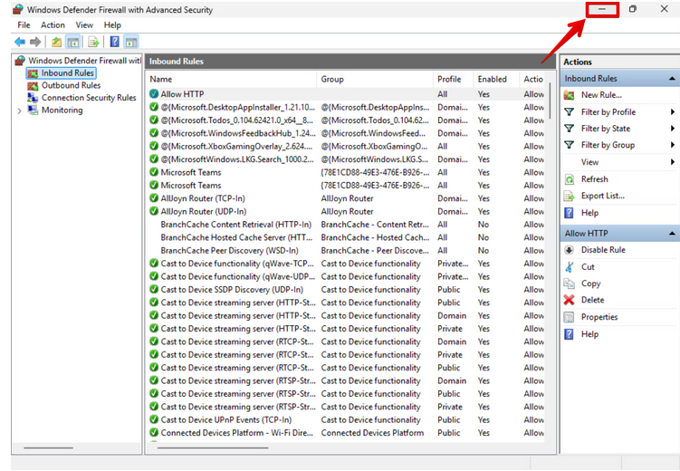

The Windows Defender Firewall console is minimized.

#### What Is Happening:

The MMC firewall console is temporarily minimized in order to transition from GUI-based configuration to command-line validation using PowerShell.

#### Technical Insight:

Firewall rules created through the GUI are written to the same local policy store accessed by PowerShell cmdlets.

Minimizing the console allows us to verify firewall behavior using CLI tools without closing the session.

#### Real-World Importance:

In enterprise environments:

- Engineers frequently switch between GUI and CLI.
- GUI is useful for visual configuration.
- PowerShell is used for auditing, scripting, automation, and remote administration.

Understanding both interfaces demonstrates operational flexibility — a critical skill in MSP and enterprise IT environments.

---

### Step 12: Verify Firewall Profiles Using PowerShell

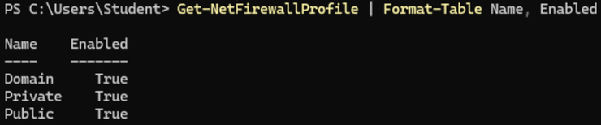

PowerShell command executed:

Get-NetFirewallProfile | Format-Table Name, Enabled

#### What This Command Does:

This retrieves the status of all Windows Firewall profiles:

- Domain
- Private
- Public

Output confirms each profile is enabled (True).

#### Technical Insight:

Each profile enforces separate inbound and outbound rule sets.

If any profile is disabled:
- The system may be exposed when switching network types.
- Security posture becomes inconsistent.

This command verifies firewall enforcement across all contexts.

#### Real-World Importance:

In enterprise environments, technicians use this command to:

- Audit endpoint compliance
- Verify baseline enforcement
- Ensure malware has not disabled firewall protections
- Perform remote health checks across large device fleets

PowerShell validation scales. GUI validation does not.

---

### Step 13: Create a Block Rule for RDP (Port 3389)

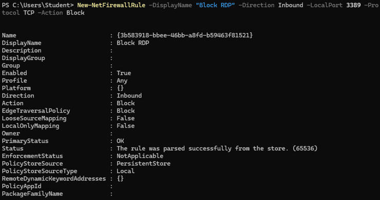

PowerShell command executed:

New-NetFirewallRule -DisplayName "Block RDP" -Direction Inbound -LocalPort 3389 -Protocol TCP -Action Block

#### What This Command Does:

Creates a new inbound firewall rule that:

- Targets TCP port 3389
- Applies to inbound traffic
- Blocks the connection
- Is enabled immediately

#### Technical Insight:

Port 3389 is used for Remote Desktop Protocol (RDP).

RDP is one of the most exploited services in:

- Brute-force attacks
- Credential harvesting
- Ransomware deployment
- Lateral movement after compromise

Blocking RDP significantly reduces attack surface.

#### Real-World Importance:

Open RDP ports are responsible for countless breaches.

Enterprise best practices include:

- Blocking RDP at endpoint
- Restricting RDP to VPN-only access
- Limiting by source IP
- Enforcing MFA
- Logging and monitoring RDP attempts

Demonstrating port-level blocking via PowerShell shows real-world defensive capability.

---

### Step 14: View All Enabled Inbound Rules

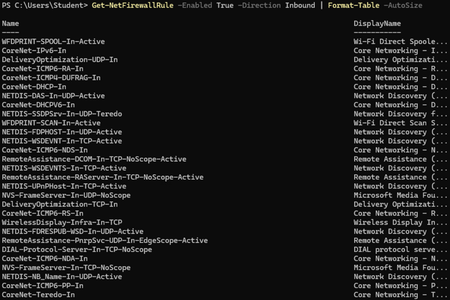

PowerShell command executed:

Get-NetFirewallRule -Enabled True -Direction Inbound | Format-Table -AutoSize

#### What This Command Does:

Displays all active inbound firewall rules.

This includes:
- Default Windows service rules
- Core networking rules
- Custom rules (Allow HTTP, Block RDP)

#### Technical Insight:

Firewall rule sprawl can occur over time.

Administrators must periodically:

- Review rule inventory
- Remove unnecessary rules
- Detect conflicting rules
- Validate rule necessity

#### Real-World Importance:

Security audits often require:

- Evidence of controlled inbound exposure
- Justification for each open port
- Confirmation that sensitive services are blocked

This command supports compliance reporting and incident response investigations.

---

### Step 15: Close Firewall Console

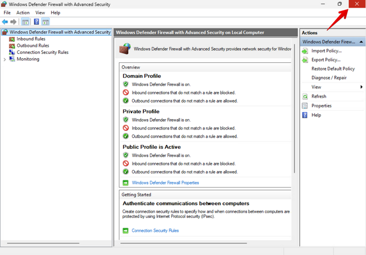

The firewall MMC console is closed.

#### Technical Insight:

Closing the console does not remove or disable rules.

Firewall policies remain stored in the Local Policy Store and enforced by the Windows Filtering Platform (WFP).

#### Real-World Importance:

Security configurations persist beyond interface sessions.

In enterprise environments:

- Firewall rules are enforced continuously
- Settings survive reboots
- Policy enforcement occurs at kernel level

Understanding persistence is critical for validating long-term configuration integrity.

---

### Step 16: Restore Firewall Console

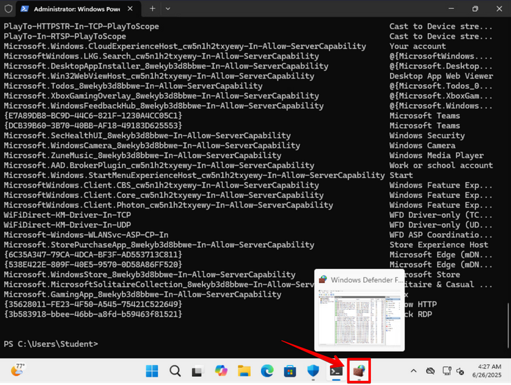

The firewall console is reopened.

#### Technical Insight:

Rules created via PowerShell (e.g., Block RDP) appear immediately in the GUI.

This confirms synchronization between:

- GUI-based management
- PowerShell-based management

Both interact with the same firewall policy store.

#### Real-World Importance:

Enterprise administrators often:

- Script changes via PowerShell
- Validate via GUI
- Capture screenshots for change management documentation

Cross-verification reduces configuration errors.

---

### Step 17: Access Global Firewall Properties

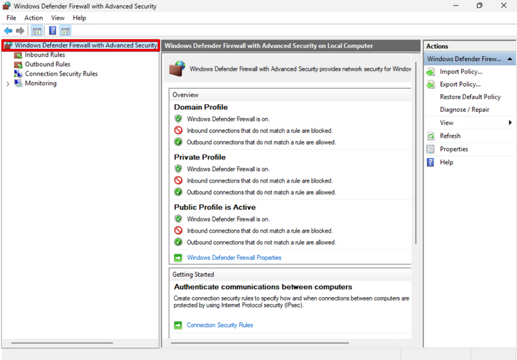

The top-level firewall node is selected.

This displays:

- Domain Profile status
- Private Profile status
- Public Profile status
- Default inbound/outbound behaviors

#### Technical Insight:

By default:

- Inbound connections not matching a rule are blocked.
- Outbound connections not matching a rule are allowed.

This represents a deny-by-default inbound model.

#### Real-World Importance:

Deny-by-default is a foundational security principle.

Enterprise security architecture depends on:

- Blocking unsolicited inbound traffic
- Explicitly allowing required services
- Minimizing exposure

This reduces vulnerability exploitation opportunities.

---

### Step 18: Open Firewall Properties Configuration

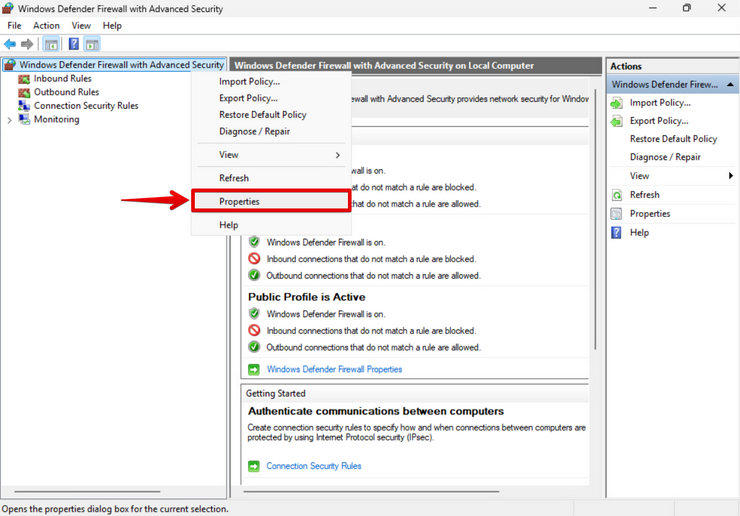

Right-clicking the firewall root node and selecting **Properties** opens advanced configuration settings.

#### What Can Be Configured Here:

- Default inbound behavior
- Default outbound behavior
- Logging of dropped packets
- Logging of successful connections
- Profile-specific settings
- IPSec enforcement
- Notification settings

#### Technical Insight:

Logging configuration is critical for:

- Detecting intrusion attempts
- Monitoring dropped traffic
- Incident response
- Forensic investigations

Firewall logs can reveal:

- Repeated RDP attempts
- Port scanning activity
- Suspicious connection patterns

#### Real-World Importance:

In enterprise environments:

Firewall logging is often required for compliance with:

- PCI-DSS
- HIPAA
- SOC 2
- NIST frameworks

Security teams use firewall logs to:

- Detect brute-force attempts
- Investigate suspicious traffic
- Correlate events in SIEM platforms

Understanding firewall property configuration demonstrates awareness of security monitoring, not just rule creation.

